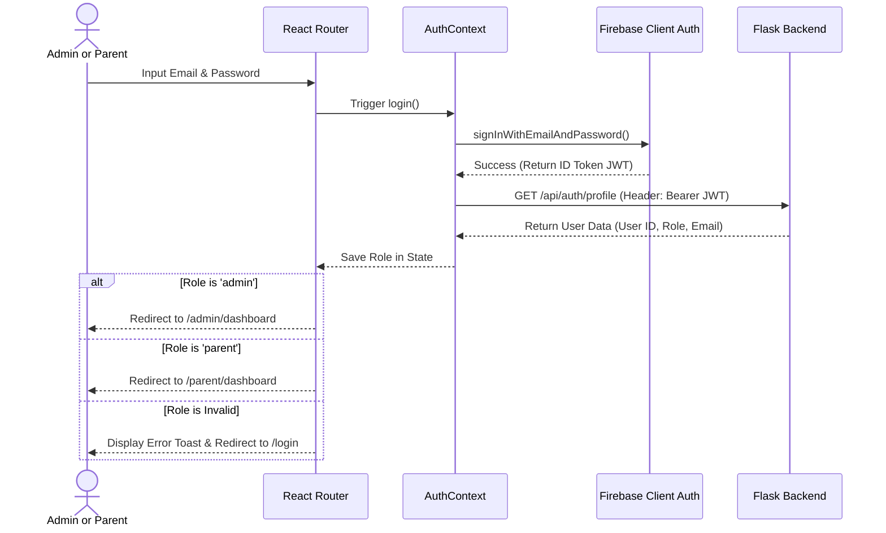
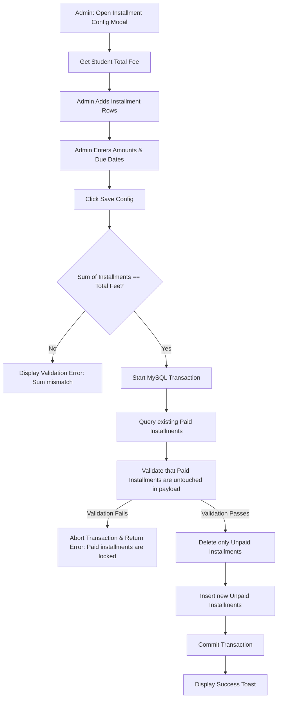
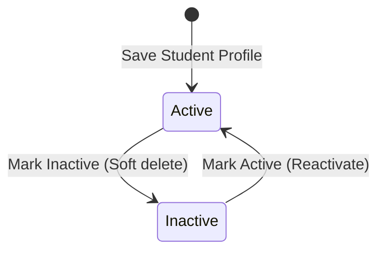
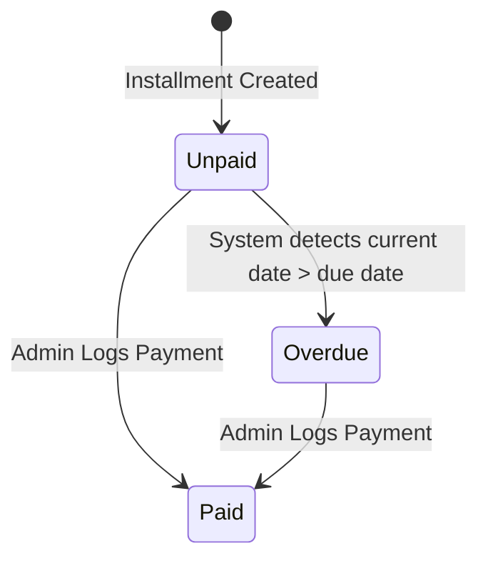
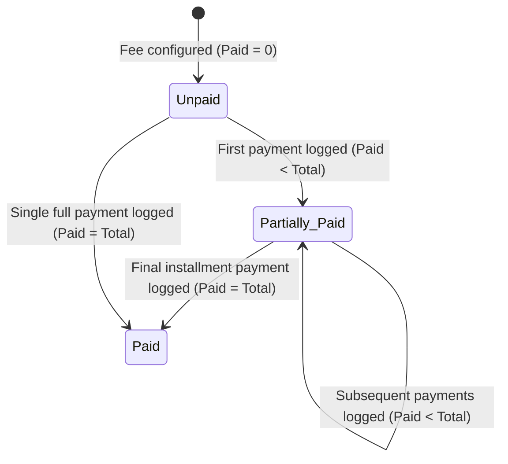

# App Flow Document
## Fees Installment & Receipt Tracker

---

## 1. Complete User Journeys

### 1.1 Registrar / Admin Journey (Sarah)
1.  **Authentication**: Sarah navigates to the application URL, enters her credentials on the login screen, and is redirected to `/admin/dashboard`.
2.  **Dashboard Overview**: Sarah checks the dashboard cards to view school-wide collections: Total Students, Total Fees Allocated, Total Fees Collected, Pending Fees, and Overdue Fees. She views the collection splits by Admission, Term, and Daycare fees along with distribution graphs.
3.  **Student Registration**: Sarah navigates to `/admin/students` $\rightarrow$ clicks "Add Student" $\rightarrow$ fills in student personal info (including Parent Email: `parent@family.com`) and inputs the fee splits:
    *   Admission Fee: `₹5,000.00`
    *   Term Fee: `₹15,000.00`
    *   Daycare Fee: `₹10,000.00`
    *   The system automatically calculates the Total Fee (`₹30,000.00`) and the Remaining Balance based on any Initial Payment logged.
4.  **Installment Setup**: Sarah clicks "Configure Fees" for the new student and splits the Total Fee into custom installment amounts with specific due dates, ensuring the total equals `₹30,000.00`.
5.  **Logging Payments**: Sarah receives a bank transfer payment for `₹10,000.00` from the parent. She searches for the student, opens the billing panel, clicks "Log Payment" for the outstanding installment, inputs the transaction date, and selects "Bank Transfer".
6.  **Receipt Export**: The system marks the installment as `Paid` and updates the student's overall paid and pending amounts. A PDF receipt is generated automatically. Sarah clicks "Download Receipt" to save or print the file in PDF.
7.  **Performance Metrics**: Sarah navigates to `/admin/reports`, filters the list of outstanding accounts, and exports a high-fidelity PDF report of accounts and balances to share with the headmaster.

### 1.2 Parent Journey (David)
1.  **Authentication**: David registers his account on the portal using `parent@family.com` (verified by Firebase Auth). Upon logging in, the system matches his email and redirects him to `/parent/dashboard`.
2.  **Dashboard Overview**: David views his landing dashboard, which displays summary cards for his children (e.g., Alice Smith and Bob Smith) showing their split fee allocations (Admission, Term, Daycare), Total Fees, Paid Amount, Pending Amount, and Installment Progress.
3.  **Child Billing Details**: David clicks on a child's profile card to open the Detailed Billing view.
4.  **Timeline Monitoring**: David views the interactive timeline displaying:
    *   Installment 1: `₹10,000.00` - `Paid` (with a "Download PDF Receipt" button).
    *   Installment 2: `₹20,000.00` - `Unpaid` (due by the configured due date).
5.  **Receipt Download**: David clicks "Download Receipt" for Installment 1 to download the official PDF receipt for his personal records.

---

## 2. Authentication & Redirection Flow



### 2.1 Parent Self-Signup Activation Flow
1.  **Firebase Registration**: The Parent signs up on the React app with their email and password. The React app invokes Firebase `createUserWithEmailAndPassword()`.
2.  **Profile Exchange**: Once authenticated, the React app captures the Firebase ID Token and sends a `POST /api/auth/activate-parent` request.
3.  **Backend Verification**:
    *   The backend decodes the token and gets the email address.
    *   It queries the MySQL `users` table: `SELECT user_id, role, firebase_uid FROM users WHERE email = :email`.
    *   *Case A (Pre-registered)*: If a user record exists with `firebase_uid IS NULL`, the backend runs `UPDATE users SET firebase_uid = :uid WHERE email = :email` and returns a success response.
    *   *Case B (Already Active)*: If `firebase_uid` matches, it returns success.
    *   *Case C (Not registered by Admin)*: If no user record exists (meaning the school has not enrolled any student with this parent email), the backend returns `403 Forbidden` with error code `EMAIL_NOT_ENROLLED`. The React client displays a notice: "Your email is not registered in our records. Please contact school administration."

### 2.2 Password Reset Flow
1.  **Request Reset**: On the login screen, the user clicks "Forgot Password".
2.  **Input Email**: A modal appears asking for their email.
3.  **Firebase Dispatch**: The React app calls Firebase SDK's `sendPasswordResetEmail(auth, email)`.
4.  **Completion**: Firebase sends the password reset email directly. The React app displays a confirmation toast: "Reset link sent to your email."

---

## 3. Student & Fee Configuration Flows

### 3.1 Student Creation & Archival/Deletion Flows
*   **Student Registration**: Checks that Student Name, Class, Admission Number, and Parent Email are valid. Verifies that `admission_number` is unique. If unique, saves the student. If the `parent_email` is new, the backend inserts a user record in `users` with `role = 'parent'` and `firebase_uid = NULL`.
*   **Student Deletion**:
    *   Admin clicks "Delete Student".
    *   Backend checks: `SELECT COUNT(*) FROM receipts WHERE student_id = :id`.
    *   *If Count > 0*: The backend blocks the deletion, returning a `400 Bad Request` with message: "Cannot delete student with transaction history." The frontend displays a modal suggesting the Admin set the status to `Inactive` instead.
    *   *If Count == 0*: The backend allows the deletion, which cascade-deletes the student's `fees` account and unpaid `installments`.

### 3.2 Installment Splitting & Edit Safeguards



---

## 4. Payment Logging & Receipt Flows

### 4.1 Payment Log Flow
1.  **Trigger Action**: Admin clicks "Log Payment" on an unpaid installment card.
2.  **Input Data**: Admin selects the Payment Date and Payment Method (Cash, Bank Transfer, Cheque, Card).
3.  **Database Transaction**:
    ```sql
    START TRANSACTION;
    -- 1. Update status
    UPDATE installments SET status = 'paid', payment_date = :pay_date WHERE installment_id = :inst_id;
    -- 2. Recalculate totals
    UPDATE fees SET paid_amount = paid_amount + :amount, pending_amount = pending_amount - :amount WHERE fee_id = :fee_id;
    -- 3. Check if overall fee is fully paid
    UPDATE fees SET status = IF(pending_amount = 0, 'paid', 'partially_paid') WHERE fee_id = :fee_id;
    -- 4. Create Receipt Record
    INSERT INTO receipts (receipt_number, installment_id, student_id, amount_paid, payment_date, payment_method, pdf_path) VALUES (...);
    COMMIT;
    ```

### 4.2 PDF Generation Service (ReportLab)
Upon committing the database transaction, the backend runs the ReportLab service:
1.  Query transaction details: Student Name, Class, Admission Number, Receipt Number, Installment Number, Payment Method, and Amount Paid.
2.  Build a standard PDF template (Letter size, grid layout) with school branding.
3.  Save the PDF file as `/static/receipts/REC-YYYYMMDD-[InstallmentID].pdf`.
4.  Provide a secured download link to the frontend.

---

## 5. Navigation Matrix & Route Permissions

| Route Path | Allowed Roles | Navigation Group | Context actions |
| :--- | :--- | :--- | :--- |
| `/login` | Public | Unauthenticated | Form inputs, role-based login redirect. |
| `/admin/dashboard` | Admin | Admin Portal | View metric cards and overdue accounts table. |
| `/admin/students` | Admin | Admin Portal | FirstCry Intellitots Portal Student Directory: roster table, filters, search, add/edit student modal. |
| `/admin/fee-management` | Admin | Admin Portal | Standalone Fee Management: Installment setup, payment logging, and student fee ledger records. |
| `/admin/settings` | Admin | Admin Portal | System configuration settings (penalties and grace periods removed). |
| `/admin/reports` | Admin | Admin Portal | Export student fee statuses as a PDF. |
| `/parent/dashboard` | Parent | Parent Portal | Card overview of children linked to the parent email (showing Admission, Term, and Daycare splits). |
| `/parent/student/:id` | Parent | Parent Portal | Student billing timeline and receipt PDF downloads. |

---

## 6. State Transition Diagrams

### 6.1 Student Account Status Transition


### 6.2 Installment Status Transition


### 6.3 Fee Payment Status Transition


---

## 7. Error Handling Flows
*   **API Network Failures**: The frontend interceptor displays a warning message to the user: "Failed to connect to server. Please check your network connection."
*   **Database Constraints (Duplicate Admission Numbers)**: If the Admin saves an existing admission number, the backend returns a `409 Conflict` status, and the UI displays a warning: "Admission Number already exists."
*   **Database Lock / Timeout**: If a transaction lock occurs, the backend rolls back changes and returns a `400 Bad Request` status, prompting the user: "Transaction failed. Please try again."
*   **Unauthorized Route Access**: If a parent user tries to access `/admin/dashboard`, the system displays an Access Denied message and redirects them to `/parent/dashboard`.
